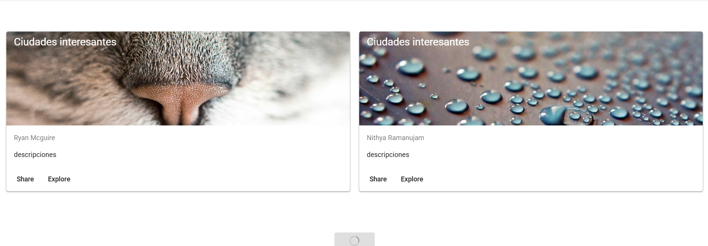
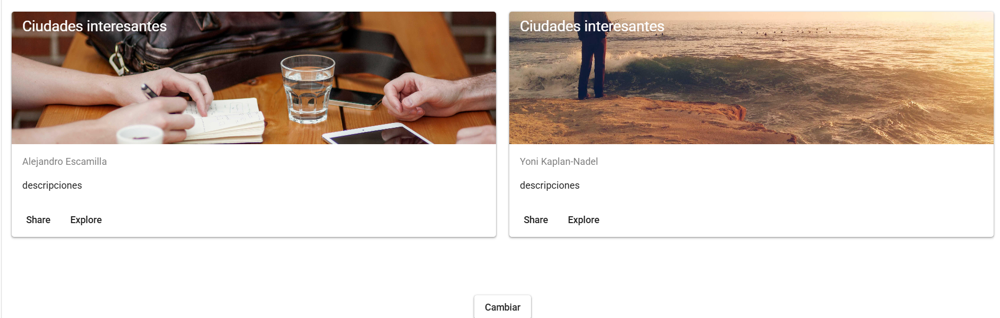
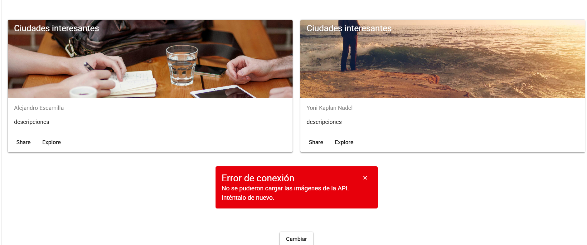
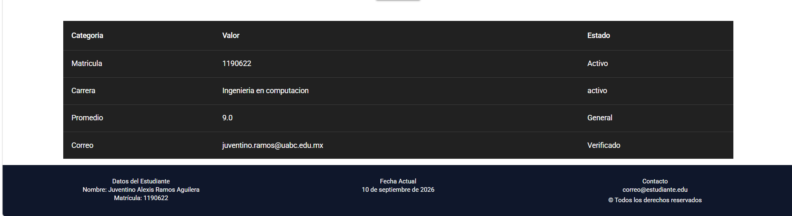
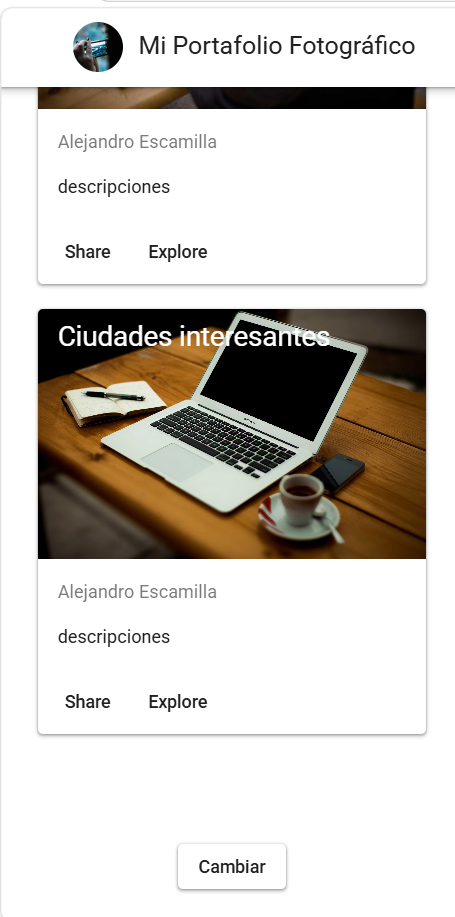
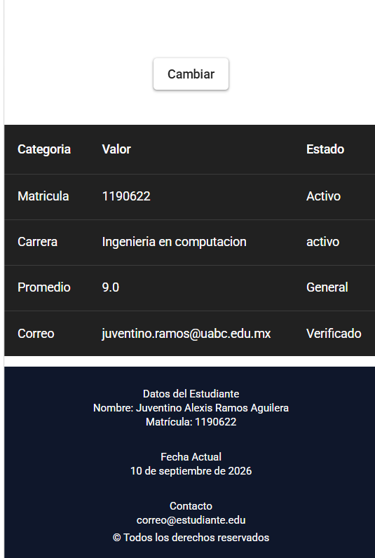

# Portafolio Fotográfico y Perfil Académico | Aplicación Web con Vue 3 & Vuetify 3

## Descripción del Proyecto

Esta aplicación web es un **portafolio interactivo de presentación personal**[cite: 1] desarrollado con **Vue 3 (Composition API)** y **Vuetify 3**[cite: 1]. La interfaz integra componentes reutilizables (Single File Components)[cite: 1] para la renderización dinámica de imágenes[cite: 1], un panel de datos académicos/técnicos[cite: 1] y un diseño adaptable a dispositivos móviles y de escritorio[cite: 1].

### Funcionalidades Principales

* **Galería Dinámica Interactiva:** Consume datos de la API REST de Picsum (`/v2/list`)[cite: 1] para renderizar dos tarjetas de imágenes independientes[cite: 1].
* **Actualización Asíncrona:** Un botón interactivo realiza peticiones asíncronas (`async/await`)[cite: 1] para obtener dos fotografías aleatorias[cite: 1] garantizando que nunca sean repetidas[cite: 1].
* **Manejo de Estados de UI:** Incluye indicadores visuales de carga en botones (`loading`)[cite: 1] y control de errores mediante alertas (`v-alert`)[cite: 1] en caso de fallas de red[cite: 1].
* **Metadatos e Información:** Presenta el nombre de los autores de cada fotografía en tiempo real[cite: 1].
* **Perfil Estudiantil:** Estructura un resumen estático del estudiante mediante una tabla de datos de 4 filas y 3 columnas (`v-table`)[cite: 1].
* **Layout Responsivo:** Incorpora un sistema de cuadrícula flexible (`v-container`, `v-row`, `v-col`)[cite: 1], un encabezado con avatar (`v-app-bar`)[cite: 1] y un pie de página con fecha calculada dinámicamente (`v-footer`)[cite: 1].

aqui pido las dos imagenes



aqui se puede ver el error por un fallo de la api


footer y la tabla


diseño responsivo 



Instalacion 
utilizar git clone https://github.com/Tino1265/meta-2.1.git

acceder a la carpeta mata2.1 utilizando el comando cd

ejecutar npm install

ejecutar npm run dev

```text
mata2.1/
|── .vscode
|── node_modules
├── public/
│   ├── favicon.ico
│   └── layers.css
├── src/
│   ├── assets/
│   │   ├── logo.png
│   │   └── logo.svg
│   ├── components/
│   │   ├── AppBar.vue
│   │   ├── Footer.vue
│   │   ├── Table.vue
│   │   └── TarjetaConImagen.vue
│   ├── pages/
│   │   └── index.vue
│   ├── plugins/
│   │   ├── index.ts
│   │   └── vuetify.ts
│   ├── router/
│   │   └── index.ts
│   ├── styles/
│   ├── App.vue
│   ├── main.ts
│   └── typed-router.d.ts
├── .gitignore
├── AGENTS.md
├── env.d.ts
├── eslint.config.js
├── index.html
├── package-lock.json
├── package.json
├── README.md
├── tsconfig.app.json
├── tsconfig.json
├── tsconfig.node.json
└── vite.config.mts